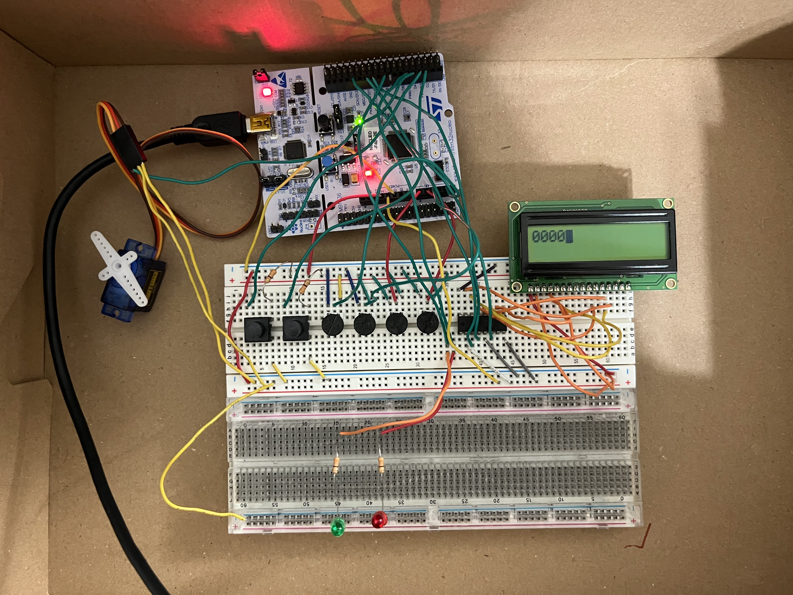
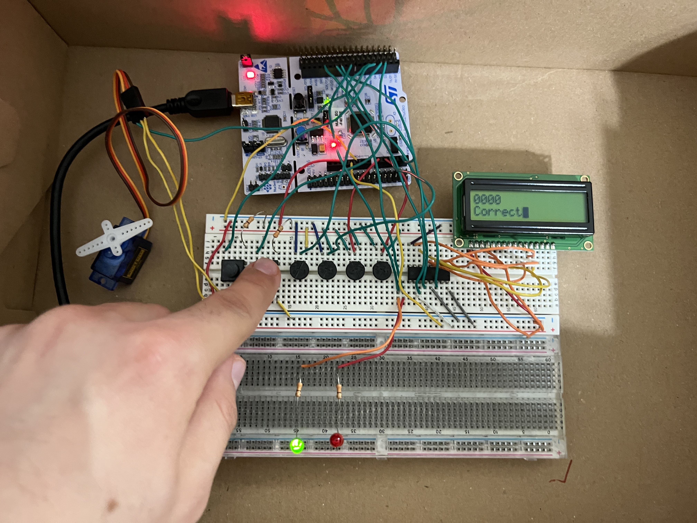
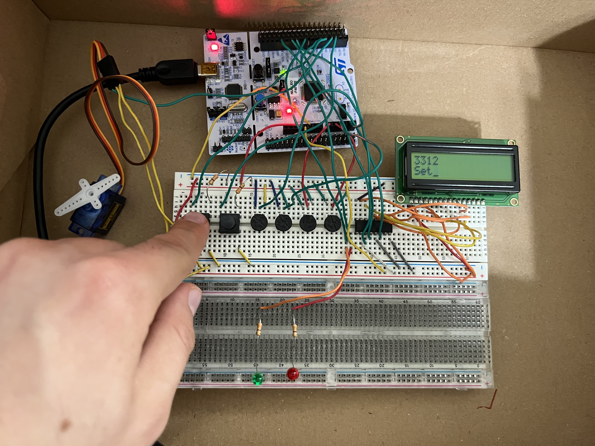
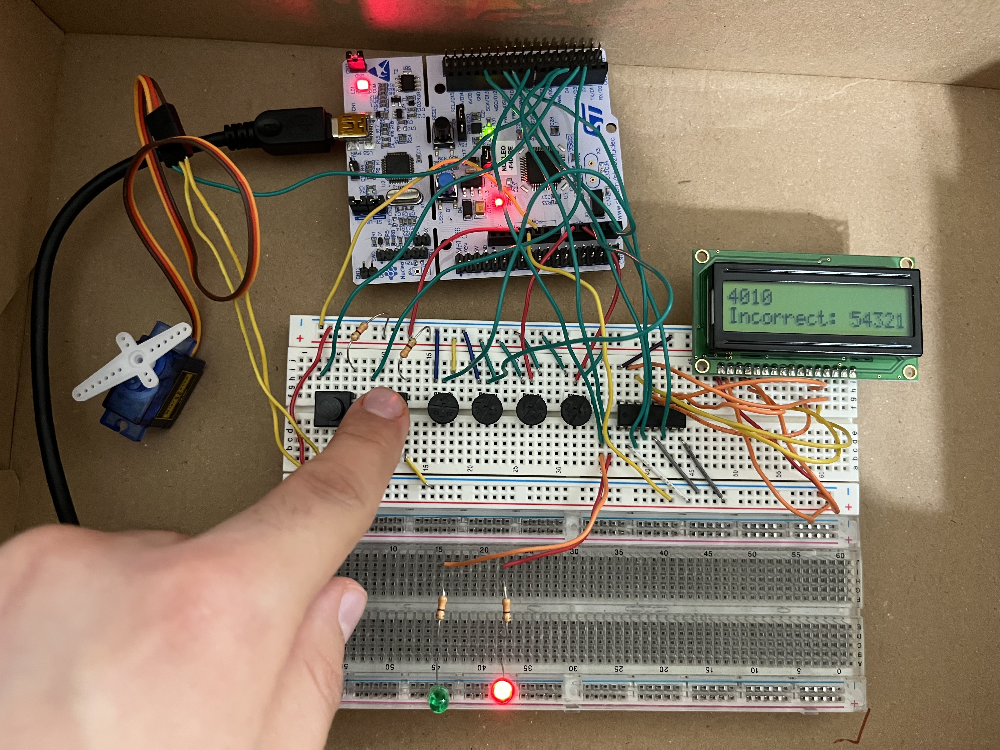
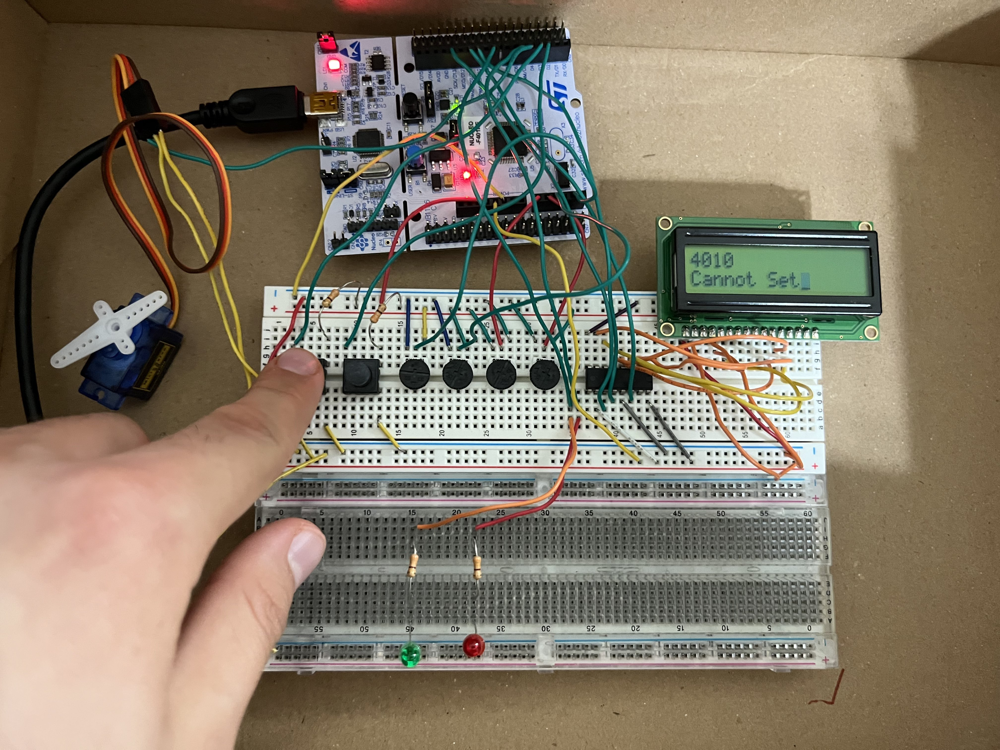

# smart-lock
The smart lock consists of 4 potentiometers that each represent an AnalogIn.
Adjusting the potentiometers would adjust the distinct digits.
It is important to note that this is a 4 digit combination. 

## Validation
The security lock consists of a validation mechanism, where it checks to
see if the current combination entered is equal to the set combination.
The board provides LED indicators along with an LCD display that does the
indication if the combination is incorrect or correct.

## Set
The security lock consists of a set mechanism, where there is a 
requirement that the user must first perform validation, then 
they may set the combination using the set button, which calls the 
reset ISR. This changes the bitmode and it is decided in a switch
statement for it to either perform the set or the validation.
There is an enterBit that if true, validation upon the current
and set combinations consist of equal digits.

## Correct

## Set

## Incorrect (Timeout)

## Cannot Set

